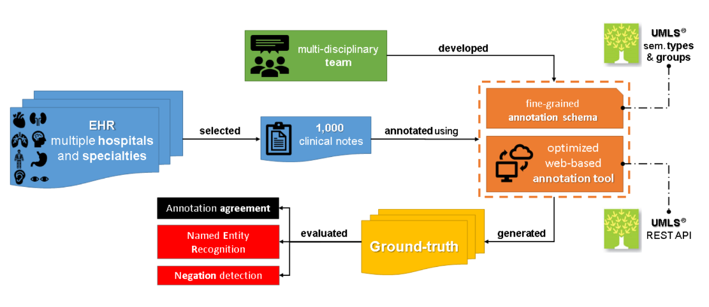

# SemClinBr
SemClinBr - a multi-institutional and multi-specialty semantically annotated corpus for Portuguese clinical NLP tasks



This repository contains the resources developed in the SemClinBr project, including:
- A Corpus of clinical narratives annotated with clinical concepts
- A text annotation tool (still in beta)
- A list of medical abbreviations
- A list of negation cues

To use the **annotated corpus**, your research team must complete and sign the request form available in this repository and send it to lucas.oliveira at pucpr.br

The other resources can be downloaded directly from this repository, without a request.

How to cite:
```
@article{Oliveira2022,
  doi = {10.1186/s13326-022-00269-1},
  url = {https://doi.org/10.1186/s13326-022-00269-1},
  year = {2022},
  month = may,
  publisher = {Springer Science and Business Media {LLC}},
  volume = {13},
  number = {1},
  author = {Lucas Emanuel Silva e Oliveira and Ana Carolina Peters and Adalniza Moura Pucca da Silva and Caroline Pilatti Gebeluca and Yohan Bonescki Gumiel and Lilian Mie Mukai Cintho and Deborah Ribeiro Carvalho and Sadid Al Hasan and Claudia Maria Cabral Moro},
  title = {{SemClinBr} - a multi-institutional and multi-specialty semantically annotated corpus for Portuguese clinical {NLP} tasks},
  journal = {Journal of Biomedical Semantics}
}
```
